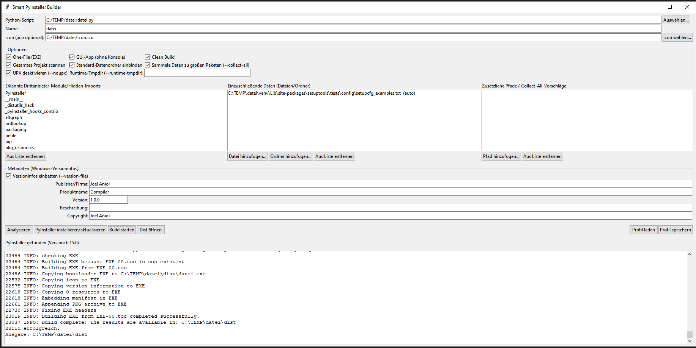

# smart-installer

Ein GUI-basierter **pyexe Python Compiler**

---

##  Inhaltsverzeichnis

- [Zweck](#zweck)  
- [Screenshot](#screenshot)  
- [Installation & Nutzung](#installation--nutzung)  
- [Voraussetzungen](#voraussetzungen)  
- [Dateiübersicht](#dateiübersicht)  
- [Lizenz / License](#lizenz--license)

---

## Zweck

Dieses Projekt bietet ein einfaches grafisches Interface, um Python-Skripte mittels **PyInstaller** in eigenständige `.exe`-Dateien umzuwandeln. Ziel ist es, den Prozess intuitiv und benutzerfreundlich zu gestalten und Entwicklern somit Arbeit abzunehmen.

---

## Screenshot

Hier siehst du, wie die Oberfläche aussieht:




---

## Installation & Nutzung

1. Repository klonen:

   ```bash
   git clone https://github.com/JoelCampoint/smart-installer.git
   cd smart-installer
